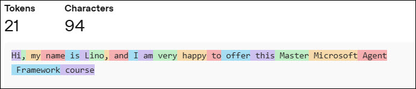

## Agent Framework Introduction


The full open source framework is available [here](https://github.com/microsoft/agent-framework)

Agent Framework combines AutoGen's simple agent abstractions with Semantic Kernel's enterprise features — session-based state management, type safety, middleware, telemetry — and adds graph-based workflows for explicit multi-agent orchestration.

Semantic Kernel and AutoGen pioneered the concepts of AI agents and multi-agent orchestration. The Agent Framework is the direct successor, created by the same teams. It combines AutoGen's simple abstractions for single- and multi-agent patterns with Semantic Kernel's enterprise-grade features such as session-based state management, type safety, filters, telemetry, and extensive model and embedding support. Beyond merging the two, Agent Framework introduces workflows that give developers explicit control over multi-agent execution paths, plus a robust state management system for long-running and human-in-the-loop scenarios. In short, Agent Framework is the next generation of both Semantic Kernel and AutoGen.

Think of it as:

**A managed, scalable runtime and orchestration layer for AI agents inside the Microsoft ecosystem.**

| Capability             | What It Does                                    |
| ---------------------- | ----------------------------------------------- |
| Agent Hosting          | Secure runtime for long-lived agents            |
| Identity & Auth        | Entra ID, RBAC, OAuth                           |
| Tool Execution         | Calling APIs, functions, workflows              |
| Memory                 | Persistent state, vector memory, grounding data |
| Orchestration          | Multi-agent coordination                        |
| Observability          | Telemetry, logging, tracing                     |
| Safety & Governance    | Content filters, auditing, policy enforcement   |
| Enterprise Integration | Microsoft Graph, M365, Dynamics, Fabric         |


### What is the relationship between Agent Framework, Semantic Kernel and AutoGen


In this first introduction you will learn how to use the Microsoft Agent Framework to chat with an LLM using the following Large Language Models:
- OpenAI
- Azure OpenAI
- Anthropic (Claude)
- Foundry AI (gpt-5-mini)
- Google (gemini-3-flash-preview)
- Grok (grok-4-fast-non-reasoning")
- Mistral (mistral-small-2506)

We will demonstrate the use of local models in March 17th session
- Ollama (gemma3:4b)
- FoundryLocal (Phi-4-mini)

You will also learn how to count the tokens:
- Input Tokens
- Output tokens
- Cached Tokens
- Reasoning Tokens
- Total tokens

Token pricing gets confusing fast, and `cached tokens` sounds like marketing fluff until you know what’s actually happening under the hood. Let’s demystify it. 😄

First: What’s a “token” anyway?
In LLM land, tokens are chunks of text (not exactly words).

Roughly:
- "hello" → 1 token
- "ChatGPT is awesome!" → ~4–5 tokens
- Long prompts + long responses = lots of tokens

You’re billed based on:
- Input tokens (what you send the model)
- Output tokens (what the model sends back)

## Cached Tokens
Cached tokens are input tokens that the model provider has already processed before and can reuse.
In practice, this usually applies to:
- Large system prompts
- Long instructions
- Repeated context (like your product docs, policies, or chatbot instructions)
- Reused embeddings / search context in AI Search + LLM patterns

Instead of reprocessing the same text over and over, the provider:

**Stores a computed representation of those tokens and reuses it.**

That saves:

⏱️ Latency (faster responses)

💰 Cost (cheaper than fresh input tokens)

⚡ Compute (less GPU work)


Finally, you will also learn how to calculate the time it takes to run your query in milliseconds.

## How Tokens are counted


## dotnet user-secrets

> [!IMPORTANT]
> For all the endpoints and the api keys, it is preferrable to use a mechanism to hide these secrets from plain text in the project so you can use Azure Key Vault, .NET User Secrets, Environment variables or GitHub Secrets.
> In these demos we wil use the .NET User Secrets.

- To initialize your user secrets in your project:

```cli
dotnet user-secrets init
```

- To list all the current secrets in the project:

```cli
dotnet user-secrets list
```

- To add a secret to the project:

```cli
dotnet user-secrets set "secret Name" "value"
```

- To remove a secret from the project:

```cli
dotnet user-secrets remove "Secret Name"
```