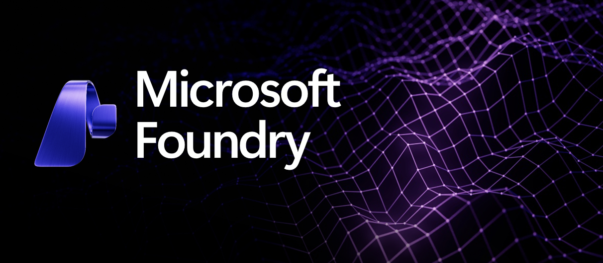

# Introduction to Microsoft Foundry

Microsoft Foundry is Microsoft’s enterprise platform for building, customizing, and operating AI applications and AI agents at scale.

It provides a complete development and operations environment for generative AI and intelligent agents, combining:

- AI models

- AI orchestration

- enterprise data connectivity

- governance and security

- deployment and monitoring tools

into a single platform designed for production-grade AI systems.

Think of Foundry as the “factory floor” where enterprise AI solutions are built, tested, governed, and deployed.

## Why Microsoft Foundry Exists

Enterprises are quickly adopting generative AI, but building real AI solutions requires far more than just calling a model API.

Organizations need to solve several challenges:

1. **Model Fragmentation**

Companies want to use multiple models such as:

- GPT-5

- Llama

- Mistral

Managing these models independently creates complexity.

2. **Enterprise Security and Governance**

Businesses must ensure:

- data protection

- responsible AI controls

- compliance

- auditing

- role-based access

Standard AI APIs do not provide enterprise governance.

3. **AI Application Complexity**

Modern AI systems require:

- prompt orchestration

- tool calling

- agents

- vector search

- retrieval augmented generation (RAG)

- model evaluation

Building this infrastructure from scratch slows down innovation.

4. **Operationalizing AI**

Even after building an AI prototype, companies still need:

- deployment pipelines

- monitoring

- cost tracking

- model evaluation

- scaling infrastructure

This is where most AI projects fail.

### Microsoft Foundry exists to solve these challenges by providing a unified enterprise AI platform.

## What Microsoft Foundry Provides

Microsoft Foundry brings together multiple AI capabilities into a single development ecosystem.

1. **Unified Model Access**

Foundry provides access to multiple AI models through a single development interface, including models from:

- OpenAI

- Meta Platforms

- Mistral AI

- Microsoft

- Anthropic

- Many more...

This allows enterprises to experiment, benchmark, and switch models easily.

2. **AI Application Development Framework**

Developers can build intelligent systems with:

- prompt orchestration

- agent frameworks

- tool integrations

- workflow automation

- AI pipelines

This enables the creation of:

- AI copilots

- autonomous agents

- knowledge assistants

- automated decision systems

3. **Enterprise Data Integration**

Foundry connects AI models to enterprise data sources such as:

- Microsoft Fabric

- Azure SQL Database

- Microsoft SharePoint

This allows AI to operate using trusted enterprise knowledge, enabling techniques like:

- Retrieval Augmented Generation (RAG)

- knowledge grounding

- semantic search

4. **Responsible AI and Governance**

Enterprises get built-in capabilities for:

- policy enforcement

- data protection

- content filtering

- compliance auditing

- model evaluation

This ensures AI solutions meet enterprise and regulatory requirements.

5. **AI Operations (AIOps for AI)**

Foundry includes operational capabilities for AI systems:

- monitoring model performance

- cost tracking

- safety monitoring

- versioning and experimentation

- deployment management

This allows AI solutions to run reliably at enterprise scale.

## The Value of Microsoft Foundry to Enterprises

For enterprises, Foundry delivers value across four key dimensions.

1. **Accelerated AI Development**

Instead of building AI infrastructure from scratch, teams can focus on creating business solutions.

This reduces development time from months to weeks.

2. **Model Flexibility**

Organizations are not locked into a single AI model.

They can easily switch between:

- GPT-5

- Llama

- other open or proprietary models

This protects organizations from vendor lock-in and rapid model evolution.

3. **Enterprise-Grade Security**

AI applications are built with the same security foundation as other Microsoft enterprise services, including:

- identity management

- role-based access

- data governance

- compliance controls

4. **Production-Ready AI**

Foundry helps organizations move from AI experiments to production systems by providing:

- deployment pipelines

- monitoring

- evaluation

- lifecycle management

## Simple Analogy

A helpful analogy when explaining Foundry:

AI Models = Raw Materials
Developers = Engineers
Applications = Finished Products

Microsoft Foundry is the factory where AI products are built.

It provides the machinery, tools, safety systems, and processes needed to manufacture enterprise AI solutions reliably.

## In One Sentence

Microsoft Foundry is Microsoft’s enterprise platform for building, customizing, and operating AI applications and agents using multiple AI models with enterprise-grade security, governance, and scalability.

## Model pricing
You can view the pricing of models in the link below to understand the difference between input tokens, output tokens, caching tokens and reasoning tokens
[Model Pricing](https://azure.microsoft.com/en-us/pricing/details/azure-openai/)

