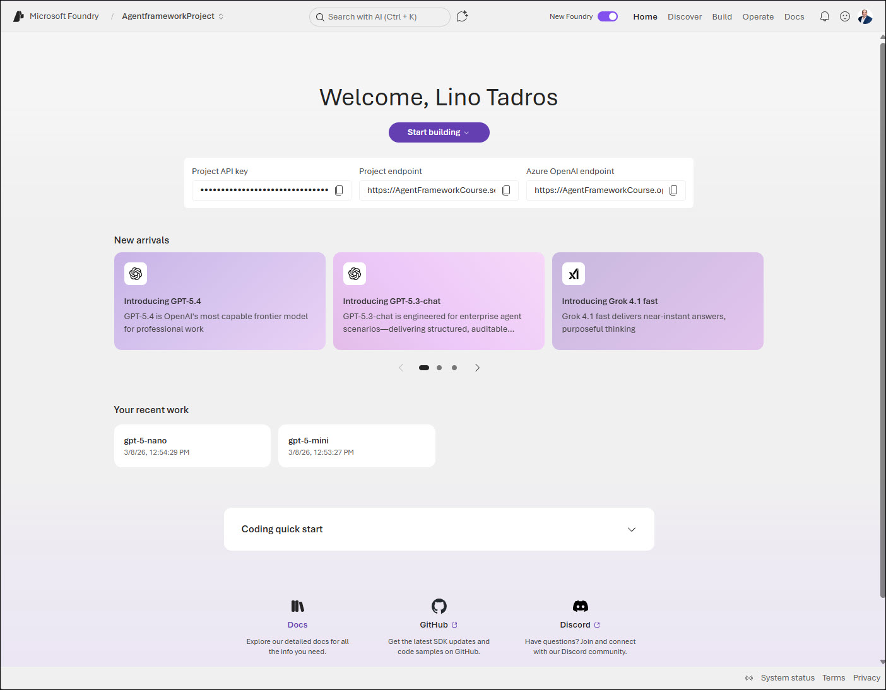

# Microsoft Foundry Setup

You can start a Microsoft Foundry resource from `ai.azure.com` or from `portal.azure.com`

We need two resources:
- The Microsoft Foundry Resource Itself
- A Microsoft Foundry Project resource.

We will take a tour of the new and older UX for Microsoft Foundry (Used to be called `Azure AI Foundry`)

During the tour, we will explain the following:
- Model Catalog
- Playground
- Agents
- Templates
- Fine Tuning
- Tracing
- Monitoring
- Evaluation
- Guardrails
- Adding Models and Endpoints