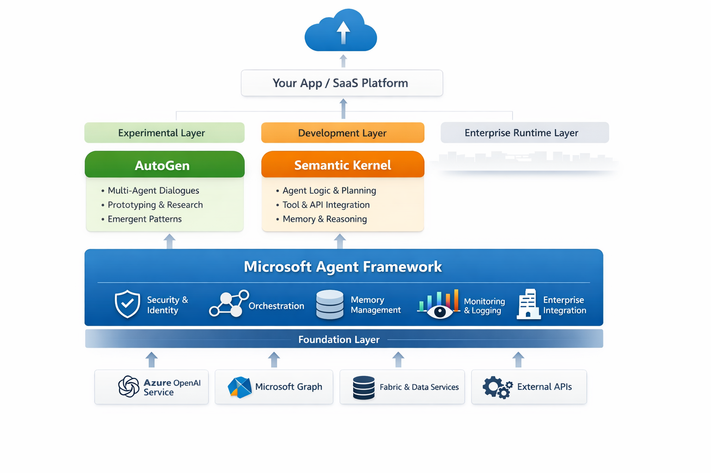

# Mastering Microsoft Agent Framework

## What Is Microsoft Agent Framework?

Microsoft Agent Framework is not a single open-source library.
It’s a platform-level concept and set of capabilities Microsoft is building across Azure and Copilot to support enterprise-grade AI agents.

Think of it as:

**A managed, scalable runtime and orchestration layer for AI agents inside the Microsoft ecosystem.**

| Capability             | What It Does                                    |
| ---------------------- | ----------------------------------------------- |
| Agent Hosting          | Secure runtime for long-lived agents            |
| Identity & Auth        | Entra ID, RBAC, OAuth                           |
| Tool Execution         | Calling APIs, functions, workflows              |
| Memory                 | Persistent state, vector memory, grounding data |
| Orchestration          | Multi-agent coordination                        |
| Observability          | Telemetry, logging, tracing                     |
| Safety & Governance    | Content filters, auditing, policy enforcement   |
| Enterprise Integration | Microsoft Graph, M365, Dynamics, Fabric         |

### What is the relationship between Agent Framework, Semantic Kernel and AutoGen

