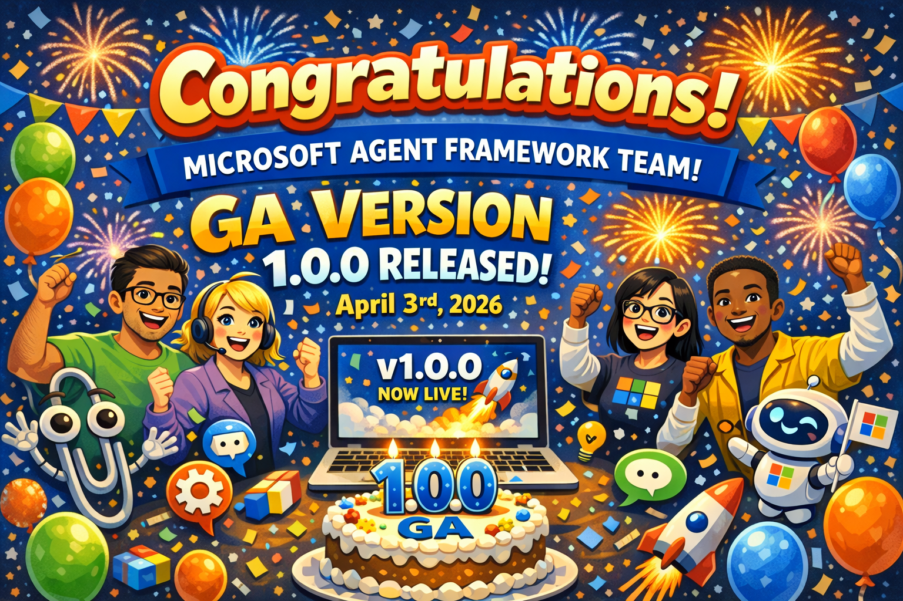
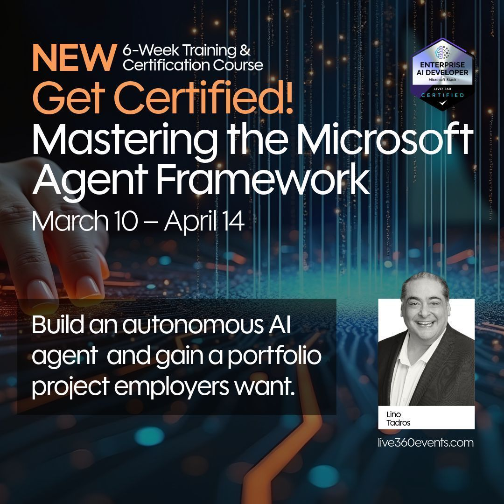

# Welcome to Mastering Microsoft Agent Framework

## Congratulations! Agent Framework went GA 1.0.0 on April 3rd 2026

Please find the agenda for the 6 weeks below:

## March 10th (2 hours)
- Introduction to Microsoft Agent Framework
- Introduction to Microsoft Foundry
- Demonstration of Microsoft Foundry Setup
- Setup the first project for Microsoft Foundry
    - OpenAI
    - AzureOpenAI
    - Anthropic Claude
    - Google Gemini
- Office hour on March 12th

## March 17th (2 hours)
- XAI Grok4
- Mistral
- Foundry AI
- Tokenization
- Working with the Microsoft Agent Framework with local SLMs
    - Ollama
    - Foundry Local
- Streaming responses
- Working with Chat History (Agent Session)
- Office hour on March 19th

## March 24th (2 hours)
- Creating our first agent
- Working with Tools
    - Function Calls
    - Code Interpreter
    - Web Search Tool
    - MCP Tool
    - Agent as a tool
- Structured Output
- Office hour on March 26th

## March 31st (2 hours)
- Working with Embeddings
- Working with Vector Stores
- Working with Semantic Search
- Working with Agent RAG Tools
- Working with Reasoning Effort
- Working with MultiModal
    - Images
    - PDF documents
- Working with Context Providers
- Office hour on April 2nd

## April 7th (2 hours)
- CosmosDB Chat History
- Working with AGUI (Agent User Interaction Protocop)
    - AGUI Server
    - AGUI Client
- Working with DevUI
- Working with Telemetry
- Office hour on April 9th

## April 14th (2 hours)
- Working with Workflows
    - Sequential Workflows
    - Concurrent Workflows
    - Handoff Workflows
    - Human in the Loop Workflows
- Wrap up